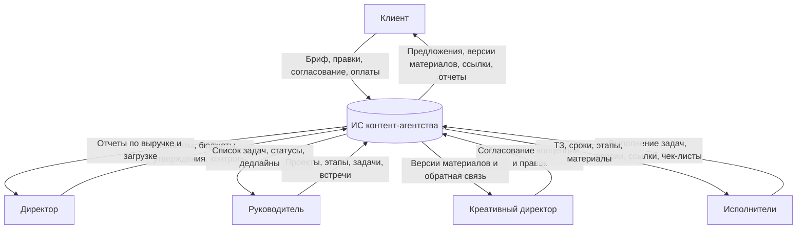
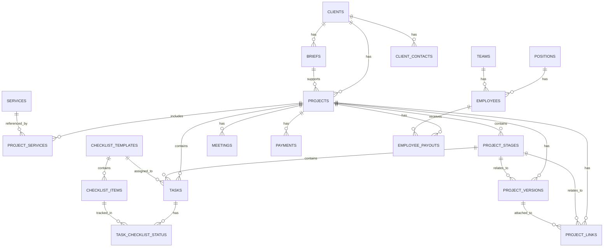
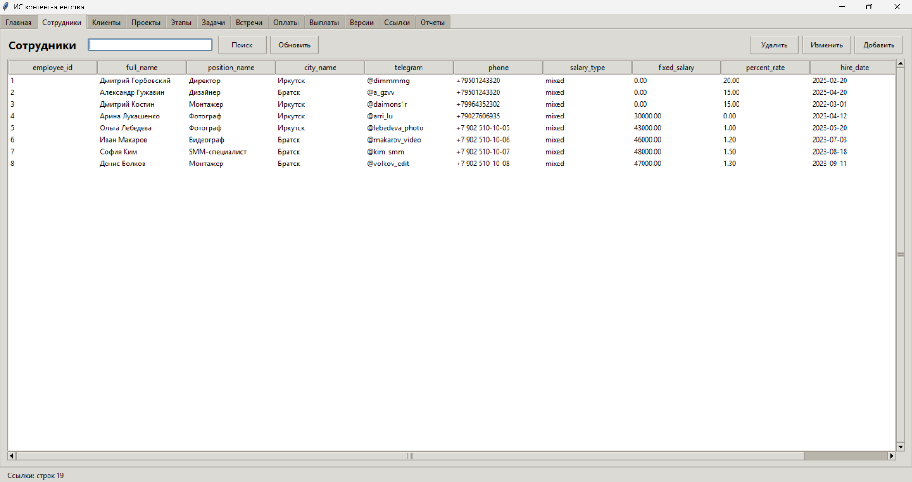

# Отчет по проекту информационной системы контент-агентства

## 1. Описание целевой аудитории и типовых задач

### 1.1. Общая характеристика целевой аудитории

Целевая аудитория системы состоит из двух групп пользователей:

- менеджмент агентства: 4 человека;
- исполнители и профильные специалисты: 4 человека.

В системе предусмотрены роли, реализованные через таблицу должностей `positions`:

- директор;
- руководитель локальной команды;
- креативный директор;
- дизайнер;
- фотограф;
- видеограф;
- SMM-специалист;
- монтажер.

Система ориентирована на небольшое или среднее контент-агентство, где один проект включает одновременно коммуникацию с клиентом, управление задачами, контроль сроков, производство материалов, согласование правок, учет оплат и выплат команде.

### 1.2. Типовые задачи целевой аудитории

**Для директора**

- регистрация нового клиента и фиксация базовой информации;
- утверждение бюджета проекта;
- назначение ответственного руководителя и креативного директора;
- контроль поступления предоплаты и финальной оплаты;
- просмотр сводных отчетов по выручке, оплатам и загрузке команды;
- контроль статусов проектов и финальных решений.

**Для руководителя локальной команды**

- создание проекта на основе брифа;
- выбор услуг и состава работ по проекту;
- планирование этапов;
- постановка задач сотрудникам;
- контроль сроков, просрочек и выполнения чек-листов;
- организация встреч, съемок, планерок и согласований;
- подтверждение завершения этапов.

**Для креативного директора**

- утверждение концепции проекта;
- согласование сценариев, визуалов и тональности материалов;
- контроль соответствия материалов стратегии клиента;
- возврат материалов на правки с фиксацией обратной связи.

**Для дизайнеров, фотографов, видеографов, SMM-специалистов и монтажеров**

- просмотр назначенных задач;
- получение ТЗ и сроков;
- загрузка результатов работы;
- фиксация статуса задачи;
- работа с версиями материалов;
- отметка прохождения чек-листов;
- использование ссылок на исходники, рабочие файлы и финальные материалы.

### 1.3. Какие типовые задачи решает БД

1. Централизованное хранение данных о клиентах, контактах и брифах.
2. Учет проектов разового и абонентского типа.
3. Хранение состава услуг по каждому проекту.
4. Поддержка этапов проекта от лида до закрытия.
5. Постановка задач по этапам с привязкой к исполнителям.
6. Контроль выполнения типовых чек-листов.
7. Учет встреч, созвонов, съемок и планерок.
8. Учет предоплаты, промежуточной и финальной оплаты клиента.
9. Учет выплат сотрудникам по смешанной схеме.
10. Хранение версий материалов и истории согласований.
11. Хранение ссылок на документы, папки, исходники и финалы.
12. Формирование отчетов для управления агентством.

## 2. Существующие аналоги на рынке ПО

### 2.1. Краткое сравнение

На рынке уже существуют системы, которые решают смежные задачи управления проектами, маркетингом, клиентами и контент-производством. Однако большинство аналогов являются либо универсальными SaaS-платформами управления задачами, либо CRM/коллаборационными платформами, а не специализированными системами для контент-агентства.

| Аналог | Архитектура | СУБД / слой данных | Функциональные возможности | Вывод относительно проекта |
|---|---|---|---|---|
| Asana | Облачная SaaS-платформа, web + desktop/mobile-клиенты | Публично не выделяется конкретная СУБД; официально описана как cloud-native платформа с распределенным datastore и Work Graph | задачи, проекты, автоматизация, правила, отчеты, интеграции, портфели, цели | Сильна в управлении задачами и отчетности, но не ориентирована на учет оплат, выплат и версий материалов как на ядро модели |
| monday.com | Облачная SaaS-платформа Work OS, no-code/low-code | Официально заявлена cloud-based платформа; в отчете упоминается schemaless database infrastructure | проекты, клиентские проекты, approvals, resource management, dashboards, автоматизация, формы | Близка по логике управления процессами, но в учебном проекте структура предметной области задана глубже и жестче |
| Bitrix24 | Облачная SaaS-версия и self-hosted/on-premise версия | Для on-premise официально указывается Percona Server 8.0 в рекомендуемом окружении; cloud-версия размещается провайдером | CRM, задачи и проекты, календари, автоматизация, аналитика, BI, knowledge base, сайт, документооборот | Ближайший массовый аналог по широте функций, но учебная БД специально фокусируется на контент-производстве и версиях материалов |
| Airtable | Облачная app-platform / low-code платформа | Официально указана relational database foundation и HyperDB | таблицы, интерфейсы, автоматизации, AI, shared data, интеграции | Очень сильна как low-code конструктор на общей структуре данных, но не дает сразу готовой специализированной модели агентства |

### 2.2. Краткое описание аналогов

**Asana**

Asana позиционируется как work management platform. Официальный сайт перечисляет задачи, проекты, представления проекта, custom fields, status updates, time tracking, portfolios и reporting dashboards. В годовом отчете компании указано, что платформа является cloud-native, работает поверх инфраструктуры Amazon Web Services и использует distributed datastore для горизонтального масштабирования. Это делает Asana сильным аналогом по части управления работой и отчетности, но не специализированным решением для учета оплат клиентских проектов и версий креативных материалов.

**monday.com**

monday.com позиционирует себя как work management platform и Work OS. На странице продукта выделены client projects, resource management, portfolio management, goals & strategy, requests & approvals. В годовом отчете компания описывает свою платформу как cloud-based no-code/low-code framework и прямо пишет про schemaless database infrastructure. Это хороший аналог по архитектурному подходу к управлению процессами, однако модель данных в учебном проекте сильнее формализована именно под контент-агентство.

**Bitrix24**

Bitrix24 интересен тем, что существует и в облачной, и в self-hosted версии. Официальный helpdesk указывает, что cloud-версия — это SaaS, а on-premise версия полностью кастомизируема и может размещаться на стороне клиента или партнера. Для self-hosted установки Bitrix24 рекомендует окружение с NGINX + Apache2 + PHP 8.2 + Percona Server 8.0. По функциональности Bitrix24 закрывает CRM, задачи, проекты, аналитическую и коммуникационную части, то есть по покрытию это один из самых близких аналогов.

**Airtable**

Airtable официально описывает себя как AI-native app platform, где можно строить custom interfaces, automations и agents. На странице платформы прямо сказано, что основой служит relational database foundation, а масштабирование до 100M records выполняется с помощью HyperDB. По духу Airtable близок к проекту как low-code среда поверх общей модели данных, но учебный проект отличается тем, что схема БД, роли, связи и процесс здесь заранее спроектированы под конкретную предметную область.

### 2.3. Почему выбран PostgreSQL

Для данного проекта выбрана СУБД PostgreSQL, потому что она:

- поддерживает строгую реляционную модель;
- хорошо подходит для нормализованных схем;
- поддерживает внешние ключи, ограничения целостности, индексы и сложные SQL-запросы;
- широко используется в учебных и промышленных проектах;
- позволяет строить клиент-серверную архитектуру;
- подходит для дальнейшего расширения проекта веб- или desktop-интерфейсом.

Для учебного проекта выбрана архитектура:

- СУБД: PostgreSQL 18;
- клиент: desktop GUI на Python/Tkinter;
- способ доступа: клиент-серверный, локальное подключение к PostgreSQL через `psql.exe`.

## 3. Описание реализуемого процесса в нотациях

### 3.1. BPMN-подобная схема процесса

```mermaid
flowchart LR
    A[Клиент обращается в агентство] --> B[Регистрация клиента]
    B --> C[Первичный контакт]
    C --> D[Созвон или встреча]
    D --> E[Заполнение брифа]
    E --> F{Нужен добриф?}
    F -- Да --> G[Проведение добрифа]
    F -- Нет --> H[Подготовка предложения]
    G --> H
    H --> I[Согласование условий]
    I --> J[Предоплата]
    J --> K[Создание проекта]
    K --> L[Добавление услуг]
    L --> M[Назначение ответственных]
    M --> N[Стратегия и план работ]
    N --> O[Препродакшн]
    O --> P[Продакшн]
    P --> Q[Постпродакшн]
    Q --> R[Передача версии клиенту]
    R --> S{Согласовано?}
    S -- Нет --> T[Правки и новая версия]
    T --> R
    S -- Да --> U[Финальная сдача]
    U --> V[Отчет клиенту]
    V --> W[Постбриф]
    W --> X[Финальная оплата]
    X --> Y[Закрытие проекта]
```



### 3.2. Контекстная DFD-схема



### 3.3. Текстовое описание процесса

Процесс начинается с регистрации клиента и фиксации первого контакта. После этого проводится встреча или созвон, заполняется бриф, при необходимости — добриф. Затем готовится предложение, согласуются условия, поступает предоплата, создается проект и назначаются ответственные. Проект проходит через этапы стратегии, препродакшна, продакшна и постпродакшна. Для этапов создаются задачи, выполнение которых контролируется через чек-листы. Материалы передаются клиенту по версиям, правки фиксируются отдельно, а ссылки на документы, рабочие файлы и финальные материалы хранятся централизованно. После финальной сдачи формируется отчет, учитывается финальная оплата, затем проект закрывается.

## 4. Схема данных

### 4.1. Логика схемы

Центральной сущностью схемы является `projects`. Вокруг нее построены:

- клиентский контур: `clients`, `client_contacts`, `briefs`;
- организационный контур: `positions`, `teams`, `employees`;
- производственный контур: `project_stages`, `tasks`, `checklist_templates`, `checklist_items`, `task_checklist_status`;
- коммуникационный контур: `meetings`;
- финансовый контур: `payments`, `employee_payouts`;
- контур материалов: `project_versions`, `project_links`;
- сервисный контур: `services`, `project_services`.

Схема нормализована, так как:

- должности вынесены в отдельный справочник;
- команды вынесены в отдельный справочник;
- контакты клиента отделены от карточки клиента;
- услуги проекта оформлены через M:M-связь;
- этапы и задачи не дублируют данные проекта;
- версии материалов и ссылки отделены от задач и этапов.

### 4.2. ER-схема данных



### 4.3. Ключевые таблицы

- `projects` — карточка проекта;
- `project_stages` — этапы жизненного цикла;
- `tasks` — задачи исполнителей;
- `payments` — платежи клиентов;
- `employee_payouts` — выплаты сотрудникам;
- `project_versions` — версии материалов;
- `project_links` — ссылки на документы и материалы.

## 5. Файл БД в выбранной СУБД

В проекте подготовлен единый файл базы данных PostgreSQL:

- `content_agency_full_db.sql`

Этот файл содержит:

- полный DDL;
- создание всех таблиц;
- внешние ключи и ограничения;
- тестовые данные по предметной области.

Также проект включает исходные раздельные SQL-файлы:

- `01_schema.sql`
- `02_seed_01_core.sql`
- `02_seed_02_projects.sql`
- `02_seed_03_tasks_checklists.sql`
- `02_seed_04_finance_materials.sql`

Для запуска проекта используется файл:

- `00_run_all.sql`

## 6. Скрин интерфейса

Ниже приведен скрин реализованного GUI приложения для работы с БД.



Файл скрина в проекте:

- `gui_login_crop.png`

Сам GUI реализован в файле:

- `content_agency_gui.py`

Файл запуска:

- `run_gui.bat`

## 7. SQL-запросы

Полный набор SQL-запросов находится в файле:

- `03_queries.sql`

Ниже приведены основные запросы, включенные в отчет.

### 7.1. Список сотрудников с должностями

```sql
SELECT
    e.employee_id,
    e.full_name,
    p.position_name,
    t.city_name AS team_city,
    e.telegram,
    e.phone,
    e.salary_type,
    e.fixed_salary,
    e.percent_rate,
    e.is_active
FROM employees e
JOIN positions p ON p.position_id = e.position_id
JOIN teams t ON t.team_id = e.team_id
ORDER BY p.position_name, e.full_name;
```

### 7.2. Проекты с клиентами и ответственными

```sql
SELECT
    p.project_id,
    p.project_name,
    COALESCE(c.company_name, c.full_name) AS client_name,
    p.project_type,
    p.status,
    director.full_name AS director_name,
    lead.full_name AS lead_name,
    creative.full_name AS creative_director_name,
    p.budget,
    p.start_date,
    p.planned_end_date
FROM projects p
JOIN clients c ON c.client_id = p.client_id
LEFT JOIN employees director ON director.employee_id = p.director_id
LEFT JOIN employees lead ON lead.employee_id = p.lead_id
LEFT JOIN employees creative ON creative.employee_id = p.creative_director_id
ORDER BY p.start_date DESC;
```

### 7.3. Задачи с исполнителями и этапами

```sql
SELECT
    t.task_id,
    pr.project_name,
    ps.stage_name,
    t.task_name,
    assignee.full_name AS assignee_name,
    assigner.full_name AS assigner_name,
    t.priority,
    t.status,
    t.planned_hours,
    t.deadline
FROM tasks t
JOIN projects pr ON pr.project_id = t.project_id
JOIN project_stages ps ON ps.stage_id = t.stage_id
LEFT JOIN employees assignee ON assignee.employee_id = t.assignee_id
LEFT JOIN employees assigner ON assigner.employee_id = t.assigner_id
ORDER BY t.deadline NULLS LAST, t.priority DESC;
```

### 7.4. Общая выручка по проектам

```sql
SELECT
    p.project_id,
    p.project_name,
    p.budget AS planned_budget,
    COALESCE(SUM(pay.amount) FILTER (WHERE pay.status = 'paid'), 0) AS paid_revenue,
    p.budget - COALESCE(SUM(pay.amount) FILTER (WHERE pay.status = 'paid'), 0) AS remaining_amount
FROM projects p
LEFT JOIN payments pay ON pay.project_id = p.project_id
GROUP BY p.project_id, p.project_name, p.budget
ORDER BY paid_revenue DESC;
```

### 7.5. Загрузка сотрудников

```sql
SELECT
    e.employee_id,
    e.full_name,
    pos.position_name,
    COUNT(t.task_id) FILTER (WHERE t.status NOT IN ('done', 'cancelled')) AS active_tasks,
    COALESCE(SUM(t.planned_hours) FILTER (WHERE t.status NOT IN ('done', 'cancelled')), 0) AS active_planned_hours
FROM employees e
JOIN positions pos ON pos.position_id = e.position_id
LEFT JOIN tasks t ON t.assignee_id = e.employee_id
GROUP BY e.employee_id, e.full_name, pos.position_name
ORDER BY active_tasks DESC, active_planned_hours DESC;
```

### 7.6. Просроченные задачи

```sql
SELECT
    t.task_id,
    p.project_name,
    t.task_name,
    e.full_name AS assignee_name,
    t.priority,
    t.status,
    t.deadline
FROM tasks t
JOIN projects p ON p.project_id = t.project_id
LEFT JOIN employees e ON e.employee_id = t.assignee_id
WHERE t.status NOT IN ('done', 'cancelled')
  AND t.deadline < CURRENT_TIMESTAMP
ORDER BY t.deadline;
```

### 7.7. Проекты без оплаченной предоплаты

```sql
SELECT
    p.project_id,
    p.project_name,
    COALESCE(c.company_name, c.full_name) AS client_name,
    p.status,
    p.budget
FROM projects p
JOIN clients c ON c.client_id = p.client_id
WHERE NOT EXISTS (
    SELECT 1
    FROM payments pay
    WHERE pay.project_id = p.project_id
      AND pay.payment_type = 'prepayment'
      AND pay.status = 'paid'
)
ORDER BY p.start_date;
```

### 7.8. Версии, ожидающие согласования

```sql
SELECT
    p.project_name,
    ps.stage_name,
    pv.version_number,
    pv.description,
    pv.sent_to_client_at,
    pv.client_feedback,
    e.full_name AS uploaded_by
FROM project_versions pv
JOIN projects p ON p.project_id = pv.project_id
LEFT JOIN project_stages ps ON ps.stage_id = pv.stage_id
LEFT JOIN employees e ON e.employee_id = pv.uploaded_by
WHERE pv.sent_to_client_at IS NOT NULL
  AND pv.is_approved = FALSE
ORDER BY pv.sent_to_client_at DESC;
```

## 8. Заключение

В результате был разработан учебный проект информационной системы контент-агентства на PostgreSQL, включающий:

- нормализованную схему данных;
- полноценный SQL DDL;
- тестовые данные;
- GUI для работы с базой;
- набор аналитических SQL-запросов.

Проект решает прикладную задачу учета клиентов, проектов, этапов, задач, согласований, финансов и материалов в рамках работы контент-агентства. Выбранная архитектура подходит для учебной и демонстрационной реализации, а также может быть расширена в сторону полноценной промышленной информационной системы.
